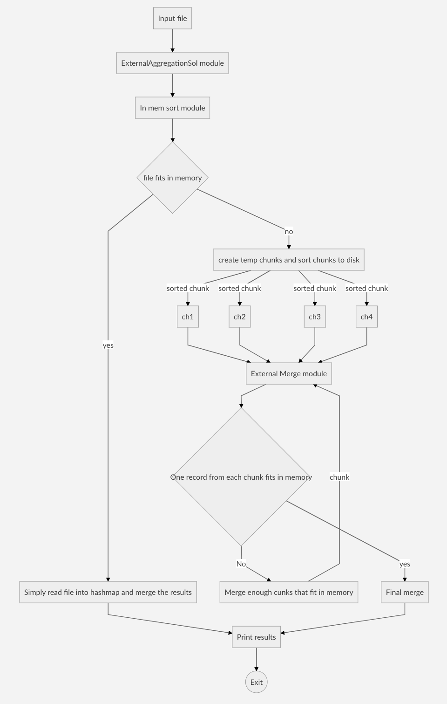

# External Aggregation for large files

#### Assumptions/Caveats
- The code assumes a directory `/tmp/output` exists as it creates temp files for merge operation there. Hence this directory must be created before the code can be executed.
- I chose to have that location as pre-existing. The temp files get created there and then the files get deleted once the JVM exits. The dir continues to exist.

#### Steps to compile the code
   - Move to the sub-dir `kanwalaggr`
   - Compile: `javac -cp . testme/ExternalAggregationSol.java`
   - Above step will create the class files needed. 
   - There is a python script that can be used to generate mock data. It can be tweaked to generate more than a million records, but right now it generates a million records randomly with key range from 1-1000. The way to run it is `python generate_data.py`. The output of this can be used as a sample data

#### How to run the code
- `java testme.ExternalAggregationSol <ram-size-in-bytes> <input-file>`

   


##### The following steps show an example all the way from generating an input file to compiling and then running:
```
1. mkdir /tmp/output
2. python generate_data.py > /tmp/inputfile
3. javac -cp . testme/ExternalAggregationSol.java
4. java testme.ExternalAggregationSol 8192 /tmp/inputfile
```



#### Design overview

As can be seen from the flowchart above the flow is divided into using two different modules
1. In memory sort module
2. External Merge Module

##### In memory sort module
- The in memory sort module is invoked by the main method. The module first checks if the file size on disk is less than the provided RAM size on the cli and if it is, it simply invokes the sort module that is directly lifted from the sample solution i.e. creates a hashmap and does the processing in linear time.
- If the in memory module  calculates that it cannot read the whole file, it starts doing the file read in chunks and then creates chunks at ``/tmp/output.`` These chunks just contain enough records that can all fit in memory.
- At the end of this in memory sort(uses Java lib to do this sort), the individual chunks are sorted by key. This groups all the  same keys together in each file. The same keys are not merged together yet.
##### External sort module
- Once all the sorted chunks are on disk, the external merge module is invoked.
- The external merge module first checks to see if a record from each file can be brought in memory or not. If a record from each file can be brought in memory, it creates a min heap and starts pulling out the keys.
- As long as the keys are same, it keeps counting how may occurrences of a key have been seen and also retains the alphabetically largest value in a variable.
- Once the heap gives a different key, it means the previous key is totally processed and can be written to disk with the frequency of its occurrence and the value(the highest one alphabetically)
- The slight complexity occurs if not one record from each chunk fits in memory. In that case, one  record each from only the first ``k`` chunks are brought into memory and merged. This way let us say if total chunks were ``C``, now we have ``C-k`` chunks from original chunks and got one more new chunk after merging the ``k`` chunks. This merge operation if ``C>k`` is the case, happens Ln(N)/Ln(k) times. Each heap operation is still ``klogk``
- If RAM size is ``R`` bytes and size of each chunk is ``S=140 bytes``, the number of chunks that can be possible to fit are ``k=R/S``(floor value). Hence the merge happens in batches of ``k``
- The overall complexity whether a record from all ``C`` chunks fits or not is still ``NLogN`` where ``N is the total rows in the original file``. Assuming fixed size of each row as ``S=140``, the total file size will always be less than or equal to ``NS``
