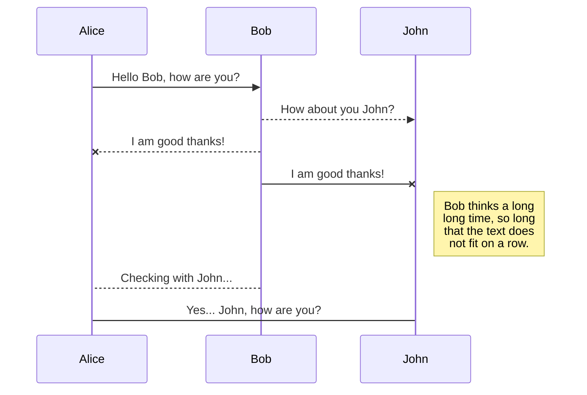
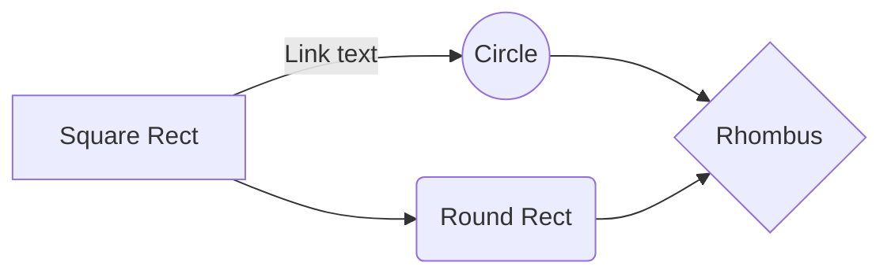

# Welcome to StackEdit!

Hi! I'm your first Markdown file in **StackEdit**. If you want to learn about StackEdit, you can read me. If you want to play with Markdown, you can edit me. If you have finished with me, you can just create new files by opening the **file explorer** on the left corner of the navigation bar.


# Files

StackEdit stores your files in your browser, which means all your files are automatically saved locally and are accessible **offline!**

## Create files and folders

The file explorer is accessible using the button in left corner of the navigation bar. You can create a new file by clicking the **New file** button in the file explorer. You can also create folders by clicking the **New folder** button.

## Switch to another file

All your files are listed in the file explorer. You can switch from one to another by clicking a file in the list.

## Rename a file

You can rename the current file by clicking the file name in the navigation bar or by clicking the **Rename** button in the file explorer.

## Delete a file

You can delete the current file by clicking the **Remove** button in the file explorer. The file will be moved into the **Trash** folder and automatically deleted after 7 days of inactivity.

## Export a file

You can export the current file by clicking **Export to disk** in the menu. You can choose to export the file as plain Markdown, as HTML using a Handlebars template or as a PDF.


# Synchronization

Synchronization is one of the biggest features of StackEdit. It enables you to synchronize any file in your workspace with other files stored in your **Google Drive**, your **Dropbox** and your **GitHub** accounts. This allows you to keep writing on other devices, collaborate with people you share the file with, integrate easily into your workflow... The synchronization mechanism takes place every minute in the background, downloading, merging, and uploading file modifications.

There are two types of synchronization and they can complement each other:

- The workspace synchronization will sync all your files, folders and settings automatically. This will allow you to fetch your workspace on any other device.
	> To start syncing your workspace, just sign in with Google in the menu.

- The file synchronization will keep one file of the workspace synced with one or multiple files in **Google Drive**, **Dropbox** or **GitHub**.
	> Before starting to sync files, you must link an account in the **Synchronize** sub-menu.

## Open a file

You can open a file from **Google Drive**, **Dropbox** or **GitHub** by opening the **Synchronize** sub-menu and clicking **Open from**. Once opened in the workspace, any modification in the file will be automatically synced.

## Save a file

You can save any file of the workspace to **Google Drive**, **Dropbox** or **GitHub** by opening the **Synchronize** sub-menu and clicking **Save on**. Even if a file in the workspace is already synced, you can save it to another location. StackEdit can sync one file with multiple locations and accounts.

## Synchronize a file

Once your file is linked to a synchronized location, StackEdit will periodically synchronize it by downloading/uploading any modification. A merge will be performed if necessary and conflicts will be resolved.

If you just have modified your file and you want to force syncing, click the **Synchronize now** button in the navigation bar.

> **Note:** The **Synchronize now** button is disabled if you have no file to synchronize.

## Manage file synchronization

Since one file can be synced with multiple locations, you can list and manage synchronized locations by clicking **File synchronization** in the **Synchronize** sub-menu. This allows you to list and remove synchronized locations that are linked to your file.


# Publication

Publishing in StackEdit makes it simple for you to publish online your files. Once you're happy with a file, you can publish it to different hosting platforms like **Blogger**, **Dropbox**, **Gist**, **GitHub**, **Google Drive**, **WordPress** and **Zendesk**. With [Handlebars templates](http://handlebarsjs.com/), you have full control over what you export.

> Before starting to publish, you must link an account in the **Publish** sub-menu.

## Publish a File

You can publish your file by opening the **Publish** sub-menu and by clicking **Publish to**. For some locations, you can choose between the following formats:

- Markdown: publish the Markdown text on a website that can interpret it (**GitHub** for instance),
- HTML: publish the file converted to HTML via a Handlebars template (on a blog for example).

## Update a publication

After publishing, StackEdit keeps your file linked to that publication which makes it easy for you to re-publish it. Once you have modified your file and you want to update your publication, click on the **Publish now** button in the navigation bar.

> **Note:** The **Publish now** button is disabled if your file has not been published yet.

## Manage file publication

Since one file can be published to multiple locations, you can list and manage publish locations by clicking **File publication** in the **Publish** sub-menu. This allows you to list and remove publication locations that are linked to your file.


# Markdown extensions

StackEdit extends the standard Markdown syntax by adding extra **Markdown extensions**, providing you with some nice features.

> **ProTip:** You can disable any **Markdown extension** in the **File properties** dialog.


## SmartyPants

SmartyPants converts ASCII punctuation characters into "smart" typographic punctuation HTML entities. For example:

|                |ASCII                          |HTML                         |
|----------------|-------------------------------|-----------------------------|
|Single backticks|`'Isn't this fun?'`            |'Isn't this fun?'            |
|Quotes          |`"Isn't this fun?"`            |"Isn't this fun?"            |
|Dashes          |`-- is en-dash, --- is em-dash`|-- is en-dash, --- is em-dash|


## KaTeX

You can render LaTeX mathematical expressions using [KaTeX](https://khan.github.io/KaTeX/):

The *Gamma function* satisfying $\Gamma(n) = (n-1)!\quad\forall n\in\mathbb N$ is via the Euler integral

$$
\Gamma(z) = \int_0^\infty t^{z-1}e^{-t}dt\,.
$$

> You can find more information about **LaTeX** mathematical expressions [here](http://meta.math.stackexchange.com/questions/5020/mathjax-basic-tutorial-and-quick-reference).


## UML diagrams

You can render UML diagrams using [Mermaid](https://mermaidjs.github.io/). For example, this will produce a sequence diagram:



And this will produce a flow chart:




# External Aggregation for large files


#### Assumptions/Caveats
- The code assumes a directory `/tmp/output` exists as it creates temp files for merge operation there. Hence this directory must be created before the code can be executed.
- I chose to have that location as pre-existing. The temp files get created there and then the files get deleted once the JVM exits. The dir continues to exist.

#### Steps to compile the code
   - Move to the sub-dir `kanwalaggr`
   - Compile: `javac -cp . testme/ExternalAggregationSol.java`
   - Above step will create the class files needed. 
   - There is a python script that can be used to generate mock data. It can be tweaked to generate more than a million records, but right now it generates a million records randomly with key range from 1-1000. The way to run it is `python generate_data.py`. The output of this can be used as a sample data

#### How to run the code
- `java testme.ExternalAggregationSol <ram-size-in-bytes> <input-file>`

   


##### The following steps show an example all the way from generating an input file to compiling and then running:
```
1. mkdir /tmp/output
2. python generate_data.py > /tmp/inputfile
3. javac -cp . testme/ExternalAggregationSol.java
4. java testme.ExternalAggregationSol 8192 /tmp/inputfile
```


```mermaid
graph TB
A[Input file] --> B[ExternalAggregationSol module]
B --> I[In mem sort module]
I --> C{file fits in memory}
C -- yes --> D[Simply read file into hashmap and merge the results ]
D --> F[Print results]
F --> G((Exit))
C -- no --> E[create temp chunks and sort chunks to disk]
E-- sorted chunk -->ch1
E--sorted chunk-->ch2
E--sorted chunk-->ch3
E--sorted chunk-->ch4
ch1-->M[External Merge module]
ch2-->M
ch3-->M
ch4-->M
M-->InMemChunks{ One record from each chunk fits in memory }
InMemChunks --No --> IM[Merge enough cunks that fit in memory] 
IM--chunk-->M
InMemChunks --yes -->FM[Final merge]

end
```

https://mermaidjs.github.io/mermaid-live-editor/#/view/Z3JhcGggVEIKQVtJbnB1dCBmaWxlXSAtLT4gQltFeHRlcm5hbEFnZ3JlZ2F0aW9uU29sIG1vZHVsZV0KQiAtLT4gSVtJbiBtZW0gc29ydCBtb2R1bGVdCkkgLS0-IEN7ZmlsZSBmaXRzIGluIG1lbW9yeX0KQyAtLSB5ZXMgLS0-IERbU2ltcGx5IHJlYWQgZmlsZSBpbnRvIGhhc2htYXAgYW5kIG1lcmdlIHRoZSByZXN1bHRzIF0KRCAtLT4gRltQcmludCByZXN1bHRzXQpGIC0tPiBHKChFeGl0KSkKQyAtLSBubyAtLT4gRVtjcmVhdGUgdGVtcCBjaHVua3MgYW5kIHNvcnQgY2h1bmtzIHRvIGRpc2tdCkUtLSBzb3J0ZWQgY2h1bmsgLS0-Y2gxCkUtLXNvcnRlZCBjaHVuay0tPmNoMgpFLS1zb3J0ZWQgY2h1bmstLT5jaDMKRS0tc29ydGVkIGNodW5rLS0-Y2g0CmNoMS0tPk1bRXh0ZXJuYWwgTWVyZ2UgbW9kdWxlXQpjaDItLT5NCmNoMy0tPk0KY2g0LS0-TQpNLS0-SW5NZW1DaHVua3N7IE9uZSByZWNvcmQgZnJvbSBlYWNoIGNodW5rIGZpdHMgaW4gbWVtb3J5IH0KSW5NZW1DaHVua3MgLS1ObyAtLT4gSU1bTWVyZ2UgZW5vdWdoIGN1bmtzIHRoYXQgZml0IGluIG1lbW9yeV0gCklNLS1jaHVuay0tPk0KSW5NZW1DaHVua3MgLS15ZXMgLS0-Rk1bRmluYWwgbWVyZ2Vd
